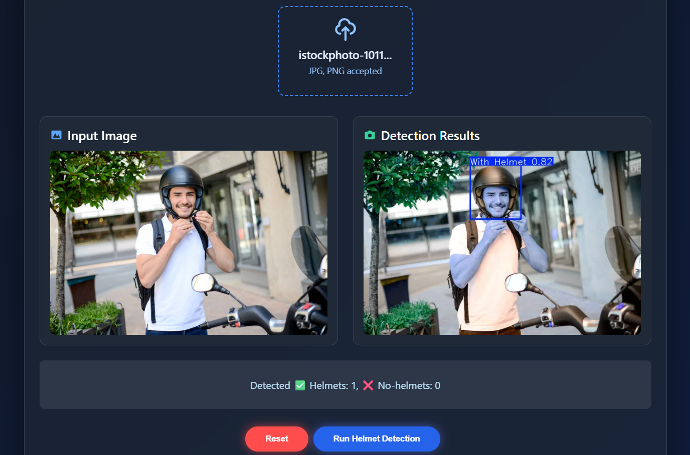

<div align="center"></div>

# 🏍️ Motorcycle Helmet Detection (YOLOv8)

[](https://helmet-detection.vercel.app)
[](https://tdcdpd-helmet-detection.hf.space)

## 📌 Overview
A **computer vision web app** that detects whether motorcycle riders are wearing helmets using **YOLOv8** object detection.

The system is trained on a public dataset from Roboflow and can process user-uploaded images, returning results with bounding boxes for **With Helmet** and **Without Helmet**.

---

## 🚀 Live Links
- **Frontend (React + Vercel)** → [helmet-detection.vercel.app](https://helmet-detection.vercel.app)  
- **Backend (Hugging Face Space)** → [tdcdpd-helmet-detection.hf.space](https://tdcdpd-helmet-detection.hf.space)

---

## 🖼️ Screenshots

### Upload & Detect


### Detection Output



---

## 🛠️ Tech Stack
**Model & Training**
- [YOLOv8](https://github.com/ultralytics/ultralytics) nano (Ultralytics)
- [Roboflow](https://roboflow.com/) for dataset preparation
- Google Colab for training

**Frontend**
- React (Vite)
- [@gradio/client](https://www.npmjs.com/package/@gradio/client) to connect to Hugging Face Space
- Vercel for hosting

**Backend**
- Hugging Face Spaces
- Gradio for serving YOLO model predictions

---

## ⚙️ How It Works
1. **Upload an image** of a motorcycle rider from the React frontend.
2. The image is sent to the Hugging Face Space running the YOLOv8 model.
3. The model predicts bounding boxes for **Helmet** and **No Helmet**.
4. The annotated image is returned to the frontend and displayed.

---

## 📂 Project Structure

```sh
frontend/      # React UI code
  src/
    App.jsx    # Main UI logic
    styles.js  # Styling

backend/       # Hugging Face Space files
  app.py       # Gradio app
  best.pt      # Trained YOLOv8 model
  requirements.txt
```

## 🚀 Development

### Prerequisites

If you have installed nodejs, proceed to install npm:
* npm
  ```sh
  npm install npm@latest -g
  ```

### Installation

_To run the front end:_

1. Clone the repo
   ```sh
   git clone [my repo link]
   ```
3. Install NPM packages
   ```sh
   npm install
   ```
4. Run Development Server
   ```sh
   npm run dev
   ```


### Front End

#### Made using React + Vite.

We use the API end point of `predict/` from our HF space to input the image and get the result of prediction.

```python
try {
    const app = await client(SPACE_URL);
    const res = await app.predict("/predict", [file]);
    let outputData = res.data[0];
    ..
    ..
```

The received output is then displayed in an image tag.

```html
<div style={styles.col}>
              <h3 style={styles.h3}>Output</h3>
              {resultURL ? (
                
              ) : (
                <div style={styles.placeholder}>No result yet</div>
              )}
            </div>
```

### Back End

#### The model is trained using Google Colab and then deployed to a Hugging Face space with Gradio sdk

To train the model we used a Roboflow dataset with following configuration.

```bash
from roboflow import Roboflow
# 👉 Fill these if using Roboflow (Recommended)
ROBOFLOW_API_KEY = "YOUR_API_KEY_HERE"   # Your API key
ROBOFLOW_WORKSPACE = "lavanya-f4fhr"        # Workspace name
ROBOFLOW_PROJECT = "bike-helmet-detection-6pxyk"      # Project name
ROBOFLOW_VERSION = 1                        # Dataset version

USE_ROBOFLOW = len(ROBOFLOW_API_KEY) > 0 and len(ROBOFLOW_WORKSPACE) > 0 and len(ROBOFLOW_PROJECT) > 0
print("Using Roboflow:", USE_ROBOFLOW)
```

### Here's the Google Colab file for this project: [Colab File](./src\assets\Helmet_NoHelmet_YOLOv8_Colab.ipynb)

## ✏️ Note

>⚠️ This is a demonstration model with low epochs for testing purposes only. It may produce inaccurate predictions on unseen data. For production, retraining with a larger, diverse dataset and proper evaluation is recommended.
>
## 📬 Contact

**Author: Thaju**
📧 Email: thajucp123@gmail.com
💼 LinkedIn: linkedin.com/in/thaju-fakrudheen/
🤗 Hugging Face: https://huggingface.co/spaces/tdcdpd/